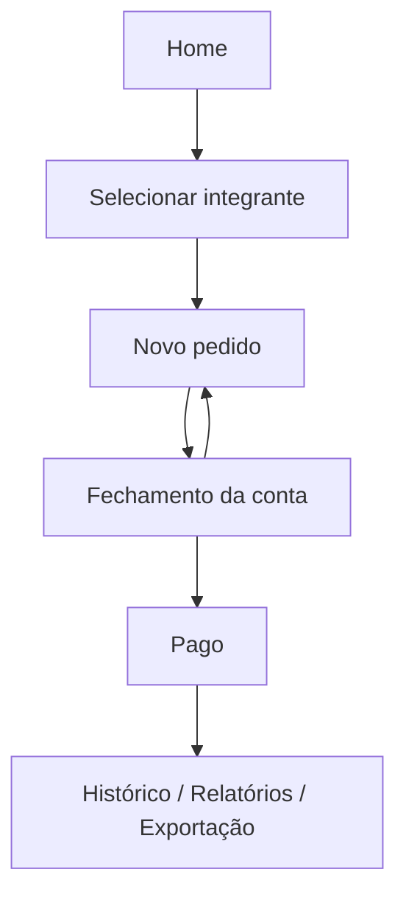
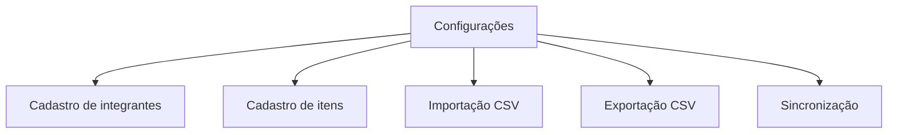

# Mapa de Navegação

Este documento resume como as telas do `Bar13` se conectam.

## Estrutura principal

O app combina:

- um conjunto de abas fixas para consulta e operação contínua
- uma navegação stack para fluxos de detalhe e edição

## Abas principais

### 1. Home

Ponto de entrada da operação diária.

Saídas principais:

- `Novo pedido` -> `Selecionar integrante`
- `Pendentes de pagamento` -> aba `Pendentes`
- `Exportar CSVs` -> `Exportação CSV`
- `Guia rápido` -> `Guia rápido`
- `Continuar pedido` -> `Novo pedido`

### 2. Histórico

Consulta por data específica.

Saídas principais:

- pedido `ABERTO` -> `Novo pedido`
- pedido `FECHADO_AGUARDANDO_PAGAMENTO` -> `Fechamento da conta`
- pedido `PAGO` -> `Fechamento da conta`
- pedido cancelado -> `Fechamento da conta`

### 3. Relatórios

Consulta consolidada por período.

Saídas principais:

- `Abrir exportação CSV` -> `Exportação CSV`
- pedidos fechados, pagos ou cancelados -> `Fechamento da conta`

### 4. Pendentes

Lista de contas aguardando pagamento.

Saídas principais:

- `Copiar mensagem` -> permanece na mesma tela
- `Abrir pagamento` -> `Fechamento da conta`

### 5. Configurações

Administração do sistema local.

Saídas principais:

- `Guia rápido do operador` -> `Guia rápido`
- `Gerenciar integrantes` -> `Cadastro de integrantes`
- `Gerenciar itens` -> `Cadastro de itens`
- `Importar integrantes via CSV` -> `Importação CSV` em modo integrantes
- `Importar itens via CSV` -> `Importação CSV` em modo itens
- `Abrir sincronização` -> `Sincronização`
- `Abrir exportação CSV` -> `Exportação CSV`

## Telas stack

### Selecionar integrante

Entradas:

- `Home`

Saídas:

- selecionar integrante -> `Novo pedido`
- `Cadastrar integrante` -> `Cadastro de integrantes`
- `Importar CSV` -> `Importação CSV` em modo integrantes

### Novo pedido

Entradas:

- `Selecionar integrante`
- `Home`
- `Histórico`

Saídas:

- `Cadastrar item` -> `Cadastro de itens`
- `Importar CSV` -> `Importação CSV` em modo itens
- `Fechar conta` -> `Fechamento da conta`
- `Cancelar pedido` -> retorno ao topo da navegação

### Fechamento da conta

Entradas:

- `Novo pedido`
- `Histórico`
- `Relatórios`
- `Pendentes`

Saídas dependendo do estado:

- `Fechar conta` -> permanece na mesma tela com novo estado
- `Reabrir conta` -> `Novo pedido`
- `PIX com comprovante` -> permanece na mesma tela com estado pago
- `Cartão de crédito` -> permanece na mesma tela com estado pago
- `Dinheiro` -> permanece na mesma tela com estado pago
- `Copiar mensagem` -> permanece na mesma tela
- `Voltar para a home` -> topo da navegação

### Cadastro de integrantes

Entradas:

- `Selecionar integrante`
- `Configurações`

Saídas:

- salvar, editar e excluir permanecem na mesma tela
- `Importar CSV` -> `Importação CSV` em modo integrantes

### Cadastro de itens

Entradas:

- `Novo pedido`
- `Configurações`

Saídas:

- salvar, editar e excluir permanecem na mesma tela
- `Importar CSV` -> `Importação CSV` em modo itens

### Importação CSV

Entradas:

- `Selecionar integrante`
- `Novo pedido`
- `Cadastro de integrantes`
- `Cadastro de itens`
- `Configurações`

Modos possíveis:

- `integrantes`
- `itens`

Saídas:

- conclusão da importação mantém o usuário na mesma tela
- retorno é feito pela navegação normal do header

### Sincronização

Entradas:

- `Configurações`

Saídas:

- `Exportar sincronização` -> fluxo de compartilhamento do sistema (permanece na tela)
- `Importar sincronização` -> resumo e confirmação (permanece na tela)

### Exportação CSV

Entradas:

- `Home`
- `Relatórios`
- `Configurações`
- `Guia rápido`

Saídas:

- exportação mantém o usuário na mesma tela
- retorno é feito pela navegação normal

### Guia rápido

Entradas:

- `Home`
- `Configurações`

Saídas:

- `Novo pedido` -> `Selecionar integrante`
- `Configurações` -> aba `Configurações`
- `Gerenciar integrantes` -> `Cadastro de integrantes`
- `Gerenciar itens` -> `Cadastro de itens`
- `Importar integrantes` -> `Importação CSV` em modo integrantes
- `Importar itens` -> `Importação CSV` em modo itens
- `Voltar para Home` -> aba `Home`
- `Ver pendentes` / `Abrir pendentes` -> aba `Pendentes`
- `Consultar histórico` / `Abrir histórico` -> aba `Histórico`
- `Abrir relatórios` -> aba `Relatórios`
- `Abrir exportação CSV` -> `Exportação CSV`

Observação:

- as telas abertas a partir do `Guia rápido` recebem um retorno contextual para voltar ao guia
- esse retorno não aparece quando as mesmas telas são abertas pelo fluxo normal do app

## Jornada principal resumida

## Jornada administrativa resumida

