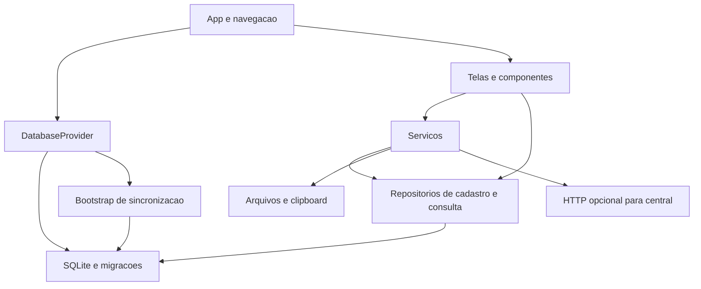

# Arquitetura e operação

## ARQ-001 — Componentes e responsabilidades



| Camada | Responsabilidade observada |
| --- | --- |
| `App.tsx`, `src/navigation` | Providers, bloqueio inicial, tema e rotas |
| `src/context` | Estado de prontidão e erro do banco |
| `src/screens`, `src/components` | Formulários, alertas, seleção de arquivos e apresentação |
| `src/services` | Fachada de pedidos, cobrança, relatórios, CSV, sincronização e central |
| `src/repositories` | SQL, mapeamento de linhas, transações e eventos |
| `src/database` | Conexão única por promise, schema e evolução aditiva |
| `src/utils`, `src/hooks`, `src/types`, `src/constants` | Formatos, arquivos, filtros, contratos TypeScript e tema |

Parte substancial das regras de pedido e cadastro está nos repositórios. `pedidosService` é uma fachada fina. `sincronizacaoService` contém SQL diretamente para bootstrap e aplicação de eventos. A separação ideal indicada no AGENTS não deve ser confundida com uma separação já completa no código.

## ARQ-002 — Inicialização

1. `SafeAreaProvider` envolve `DatabaseProvider`.
2. O provider chama `initializeDatabase`, depois `ensureSyncBootstrap`.
3. A conexão abre `bar13.db` com `expo-sqlite` e reutiliza a promise de abertura.
4. Schema e migrações são aplicados; identidade e eventos de registros antigos são preparados.
5. Apenas após sucesso o app monta `NavigationContainer` e as telas.
6. Durante espera, mostra marca, indicador e texto de preparação. Em erro, continua bloqueado, mostra a mensagem e mantém o indicador; não oferece botão de tentar novamente.

## ARQ-003 — Persistência e atomicidade

Operações locais de criação/edição de cadastros, consumo e mudanças de estado normalmente agrupam escrita operacional e evento em `BEGIN TRANSACTION`/`COMMIT`, com `ROLLBACK` em falha. A obtenção de metadados pode ocorrer antes da transação, portanto sequências podem ter lacunas. Não há uma fila global de escrita nem garantia adicional contra ações simultâneas de telas diferentes.

Arquivos não participam da transação SQLite. Cópias anteriores ao pagamento e gravações de blobs anteriores a uma falha de importação podem permanecer no armazenamento. Limpezas em massa e reset usam sequências de SQL, sem transação global envolvendo arquivos.

## ARQ-004 — Stack e dependências

Versões declaradas: Expo `~54.0.33`, React Native `0.81.5`, React `19.1.0`, TypeScript `~5.9.2`. Navegação React Navigation 7; banco `expo-sqlite`; arquivos `expo-file-system/legacy`; seleção `expo-document-picker`; compartilhamento `expo-sharing`; texto copiado com `expo-clipboard`; QR com `react-native-qrcode-svg` e `react-native-svg`. `expo-image-picker` está instalado, mas não integra o fluxo atual de seleção de comprovante ou configuração.

O TypeScript estende `expo/tsconfig.base` com `strict: true`. ESLint usa `eslint-config-expo/flat`, ignora `dist/*` e possui exceção de resolução para `@expo/vector-icons`.

## ARQ-005 — Requisitos não funcionais observados

- Persistência local entre sessões, condicionada à conservação do banco e dos arquivos pelo aparelho.
- UI em português, moeda BRL, datas exibidas em pt-BR e tema escuro.
- Compartilhamento condicionado ao suporte do sistema operacional.
- Consultas e pacotes carregam coleções em memória; não há paginação geral, limites de volume declarados ou SLA de desempenho medido.
- Não há criptografia adicional do banco/arquivos, assinatura de pacotes, autenticação do operador ou mecanismo de backup automático implementado.
- A integração HTTP usa a URL configurada; não há verificação obrigatória de domínio/HTTPS nem timeout explícito no `fetch`.

Esses limites descrevem o código; não representam auditoria de segurança ou certificação de disponibilidade.

## ARQ-006 — Comandos existentes

Na raiz do repositório:

```bash
npm install
npm run start
npm run android
npm run ios
./scripts/codex-check.sh
```

O último comando executa wrappers de typecheck e lint; só executa testes se houver script `test` no `package.json` (inexistente nesta baseline). Não roda build. Também existem `npm run typecheck`, `npm run lint`, `./scripts/ai-typecheck.sh` e `./scripts/ai-lint.sh`.

Distribuição explicitamente solicitada usa os scripts existentes `build:android:internal`, `build:android:local` ou `install:android:usb`. Eles acionam EAS/Expo e não compõem a validação documental. Nenhuma configuração de distribuição ou credencial é reproduzida aqui.

## Fontes

[App](../App.tsx), [provider](../src/context/DatabaseContext.tsx), [conexão](../src/database/connection.ts), [serviços](../src/services), [package.json](../package.json), [TypeScript](../tsconfig.json), [ESLint](../eslint.config.js), [check](../scripts/codex-check.sh).
