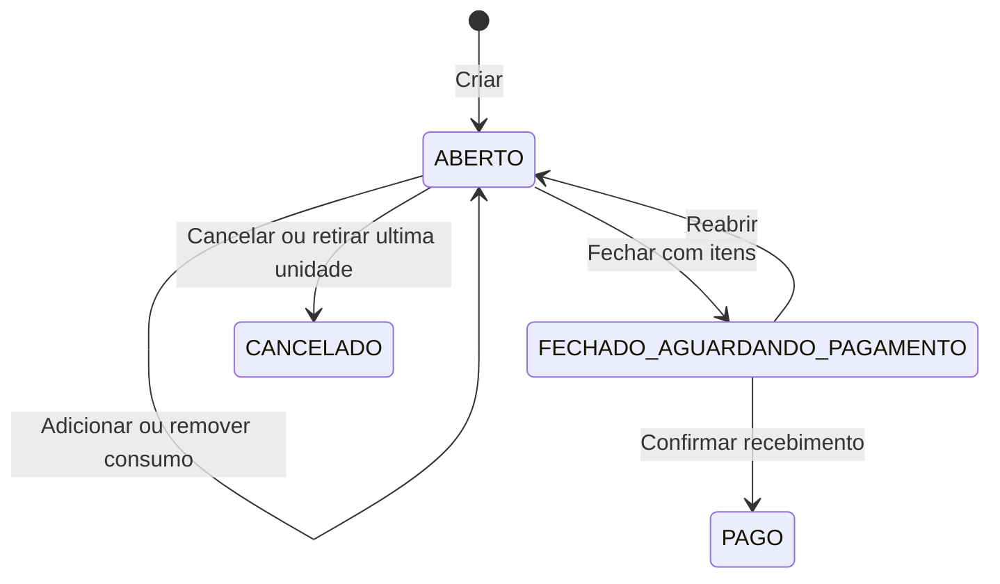

# 003 — Pedidos e estoque operacional

**Estado:** implementado, com limites de concorrência e preço registrados abaixo. **Ator:** operador atual ativo. **Precondições:** integrante cadastrado; itens cadastrados com saldo para adicionar consumo.

## Requisitos

| ID | Comportamento |
| --- | --- |
| PED-001 | Exigir operador atual com sync ID, nome e cadastro ativo para iniciar/retomar via seleção, adicionar, remover, cancelar, fechar e reabrir |
| PED-002 | Ao iniciar, procurar pedido aberto não cancelado do integrante na data local de hoje e retornar seu ID; se não existir, criar um pedido |
| PED-003 | Copiar nome/patente do integrante, operador responsável, aparelho de origem e data/hora na criação; iniciar com total zero e status `ABERTO` |
| PED-004 | Permitir alteração de consumo apenas em `ABERTO` não cancelado |
| PED-005 | Adicionar uma unidade por toque, validando novamente existência e saldo positivo no banco, debitando uma unidade de estoque |
| PED-006 | Agregar unidades por par pedido/item no fluxo local; criar linha com snapshots quando ainda não existir |
| PED-007 | Ao remover uma unidade, devolver uma unidade ao estoque e reduzir quantidade/subtotal; remover a linha se ficar sem unidades e houver outra linha |
| PED-008 | Se remover a última unidade da única linha, cancelar o pedido, zerar total e preservar a linha como registro histórico |
| PED-009 | Cancelar manualmente apenas pedido aberto não cancelado, devolver estoque de todas as linhas, marcar data de cancelamento e zerar total sem apagar pedido/linhas |
| PED-010 | Fechar apenas pedido aberto não cancelado com pelo menos uma linha, após confirmação da UI, passando a `FECHADO_AGUARDANDO_PAGAMENTO` |
| PED-011 | Reabrir conta fechada pendente sem movimentar estoque; pedido já aberto retorna sem mutação; pago ou cancelado não reabre |
| PED-012 | Persistir mudanças operacionais e eventos correspondentes em transação SQLite |

## Estados

`CANCELADO` no diagrama é estado operacional derivado: o banco mantém o status anterior e grava `cancelado = 1`. Não é um quarto valor do enum. No fluxo local, o status remanescente é `ABERTO`. `PAGO` permite troca de comprovante conforme [pagamentos](004-pagamentos.md), sem voltar à edição de consumo.

## Fluxo principal

Home → Novo pedido → Selecionar integrante → criar/retomar → NovoPedido. A seleção substitui a rota pelo pedido. Buscar itens pelo nome; cards em duas colunas exibem preço e estoque e ficam desabilitados quando esgotados. Cada inclusão atualiza total e saldo e mostra feedback com o nome do item. Linhas oferecem `+` e `-`.

Fechar pede confirmação e substitui a rota por FechamentoConta. Cancelar pede confirmação e volta ao início; cancelamento automático também informa o resultado e volta ao início. Voltar da tela sem cancelar mantém o pedido persistido para retomada pela Home ou Histórico.

## Cálculo efetivo e snapshots

Na primeira inclusão, quantidade = 1, subtotal = preço recebido e `valor_unitario_snapshot` = esse preço. Em novas inclusões na mesma linha, subtotal = nova quantidade × `item.valor` recebido pela ação; **o código não atualiza `valor_unitario_snapshot` da linha existente**. Na redução, subtotal = nova quantidade × snapshot originalmente salvo. O total é a soma dos subtotais, salvo cancelamento, que o força a zero.

Assim, com preço constante, os cálculos são coerentes. Após mudança cadastral de preço, aumentar a linha pode produzir subtotal divergente do snapshot mostrado; não se deve especificar congelamento de preço como uma garantia completa. Não há arredondamento monetário explícito na persistência; formatação de duas casas ocorre na exibição/exportação.

## Limites do fluxo

- Reaproveitamento no mesmo dia é uma consulta antes da inserção, não uma restrição `UNIQUE`. Reabertura, importação e operações concorrentes não verificam essa unicidade.
- A busca do item para o `+` da linha usa a lista atualmente filtrada. Se o filtro excluir esse item, o toque não adiciona unidade.
- Seleção de integrante e NovoPedido usam `useEffect`, não recarga por foco; voltar de um cadastro auxiliar pode exigir nova busca/remontagem para atualizar a lista.
- A validação de estoque ocorre antes da transação; não existe garantia formal de exclusão mútua para toques concorrentes.
- O diálogo de cancelamento diz “removido da base local”, mas a execução preserva o pedido cancelado.

## Eventos

`PEDIDO_CRIADO`, `PEDIDO_ITEM_ADICIONADO`, `PEDIDO_ITEM_REMOVIDO`, `PEDIDO_FECHADO`, `PEDIDO_REABERTO`, `PEDIDO_CANCELADO`. Eventos de linha transportam a quantidade final, não apenas um delta; ver [contrato](../contratos/sincronizacao.md).

## Aceitação

- **AC-PED-01 — Operador obrigatório:** Dado aparelho sem operador válido, quando iniciar ou alterar pedido, então receber erro sem a mutação operacional solicitada.
- **AC-PED-02 — Retomada:** Dado pedido aberto hoje para o integrante, quando selecioná-lo novamente em execução sequencial, então retornar o mesmo ID. Pedido de ontem não impede nova abertura hoje.
- **AC-PED-03 — Consumo:** Dado item de R$ 7,50 com estoque 3, quando adicionar duas unidades, então saldo 1, quantidade 2, subtotal e total R$ 15,00. Remover uma unidade resulta em saldo 2 e total R$ 7,50.
- **AC-PED-04 — Esgotado:** Dado saldo zero, quando tentar incluir unidade, então recusar; card deve mostrar “Esgotado”.
- **AC-PED-05 — Última unidade:** Dado pedido com uma única linha de uma unidade, quando removê-la, então devolver uma unidade, cancelar e zerar total, mantendo a linha histórica.
- **AC-PED-06 — Cancelamento:** Dado pedido aberto com duas linhas, quando confirmar cancelar, então devolver todas as quantidades e conservar pedido/linhas com marca e data de cancelamento.
- **AC-PED-07 — Fechamento:** Dado pedido vazio, quando tentar fechar, então bloquear. Com linha válida, confirmar fechamento muda o status sem nova baixa de estoque.
- **AC-PED-08 — Reabertura:** Dado pedido pendente, quando reabrir, então permitir consumo novamente sem alterar saldo pela reabertura. Pago ou cancelado deve ser recusado.
- **AC-PED-09 — Persistência:** Dado pedido aberto com consumo, quando encerrar e reiniciar o app, então ele continua disponível após bootstrap bem-sucedido.

## Fontes

[Repositório](../../src/repositories/pedidosRepository.ts), [serviço](../../src/services/pedidosService.ts), [seleção](../../src/screens/SelecionarIntegranteScreen.tsx), [pedido](../../src/screens/NovoPedidoScreen.tsx), [cards](../../src/components/ItemCard.tsx), [linhas](../../src/components/OrderItemRow.tsx).
