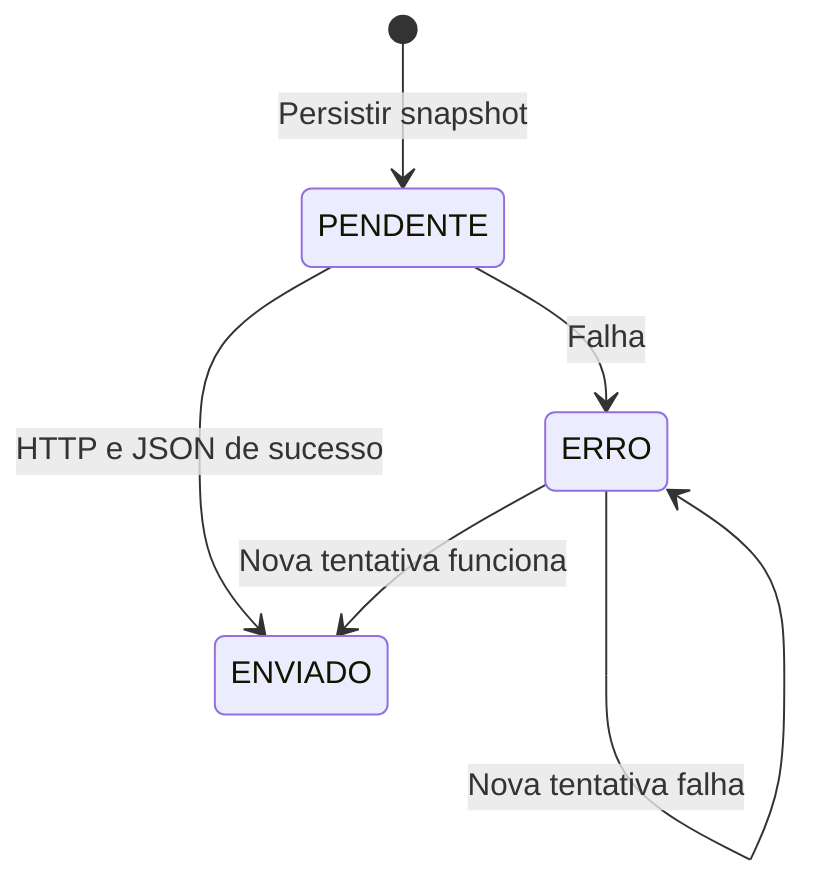

# 008 — Central gerencial e fila de envio

**Estado:** cliente mobile e receptor Apps Script implementados no repositório; publicação externa não verificada. **Atores:** pessoa acionando envio, Web App e planilha configurados. **Precondições:** URL, token e device ID não vazios; conectividade para concluir HTTP. Não exige operador selecionado para enviar.

## Requisitos

| ID | Comportamento |
| --- | --- |
| CEN-001 | Oferecer “Enviar para a central” na Home e Sincronização, com loading, bloqueio do botão e progresso por lote |
| CEN-002 | Validar configuração e criar um novo snapshot integral em fila local antes de cada rodada de envio |
| CEN-003 | Incluir todos os pedidos/linhas, operadores ativos e inativos, aparelhos conhecidos e eventos de auditoria de pedidos/comprovantes |
| CEN-004 | Enviar lotes `PENDENTE` e `ERRO` por ordem de criação e ID, do mais antigo ao mais novo |
| CEN-005 | Em sucesso HTTP com `ok` verdadeiro no JSON, marcar `ENVIADO`, registrar resposta e datas e limpar erro |
| CEN-006 | Em falha, marcar lote `ERRO`, preservar payload, registrar mensagem e interromper a rodada; novo acionamento tenta a fila novamente |
| CEN-007 | Mostrar configuração disponível, quantidade de lotes pendentes/erro e, na Sincronização, estado/data/erro do último lote criado |
| CEN-008 | Receptor deve conferir token compartilhado configurado em propriedade do Apps Script e envelope versão 1 |
| CEN-009 | Receptor faz upsert por chaves estáveis nas cinco abas de dados e acrescenta log de sucesso/erro |
| CEN-010 | A central é somente destino de dados; a resposta não modifica pedidos, estoque ou cadastros locais |

## Fluxo e estados

ID do lote usa `central_<deviceId>_<timestamp base36>`. Cada clique válido adiciona um novo snapshot, mesmo se já houver lotes com erro. O token não integra `payload_json`; a tentativa envolve o payload armazenado com o token e URL da configuração atual. Sucessos anteriores permanecem enviados se um lote posterior falhar.

Progresso começa com zero enviados e total da fila; cada sucesso incrementa a quantidade e arredonda `enviados/total × 100`. A UI mostra contagens e percentual, não bytes transmitidos. Não há worker em background, retentativa automática, backoff ou timeout explícito.

## Conteúdo e receptor

[Contrato completo](../contratos/central.md). O snapshot não filtra por período nem status, portanto inclui cancelados. Auditoria inclui criação, adição/remoção de linhas, fechamento, reabertura, pagamento, cancelamento e troca de comprovante; não inclui payload completo dos eventos nem upserts de cadastros. Comprovante vai somente pelo nome no pedido, sem arquivo, URI ou Base64.

O script distribuído oferece `doGet` com `ok: true, status: ready`; `doPost` lê JSON, compara token, valida campos estruturais, prepara cabeçalhos, atualiza dados e devolve contagens. Falhas retornam JSON `ok: false` e mensagem. O app também exige sucesso HTTP, pois erros lógicos podem chegar com HTTP bem-sucedido.

Resposta vazia, HTML e JSON inválido têm mensagens específicas. Texto inválido genérico é resumido a 160 caracteres antes de compor o erro. Na resposta válida, contagens ausentes viram zero e `batchId` ausente usa o ID enviado; não há validação estrutural completa ou conferência de igualdade do ID retornado.

## Limites de consistência

Upsert da planilha é incondicional por chave, sem comparação de `updated_at`, transação global ou exclusão de linhas ausentes do snapshot. Repetir lote não duplica a linha de dados, mas gera novo log e conta todas as linhas tocadas. Linha removida de um pedido local pode continuar na planilha; envio antigo por outro aparelho pode substituir informação nova. O último lote exibido é o mais recentemente criado, não necessariamente o lote que interrompeu a fila por erro.

## Aceitação

- **AC-CEN-01 — Configuração:** Dada URL/token/identidade ausentes, quando enviar, então informar precondição faltante sem criar novo lote.
- **AC-CEN-02 — Fila:** Dada configuração preenchida e rede indisponível, quando enviar, então manter snapshot local e marcar erro da tentativa.
- **AC-CEN-03 — Retomada:** Dados lotes pendentes/erro e conectividade, quando acionar novamente, então criar snapshot atual e processar fila em ordem, marcando cada sucesso como enviado.
- **AC-CEN-04 — Resposta inválida:** Dado endpoint devolvendo HTML, corpo vazio ou JSON `ok: false`, quando tentar enviar, então informar falha, persistir erro e parar a rodada.
- **AC-CEN-05 — Upsert:** Dado pedido já na planilha por sync ID, quando receber snapshot com o mesmo ID, então atualizar essa linha sem duplicá-la e adicionar log.
- **AC-CEN-06 — Unidirecional:** Dado snapshot enviado com sucesso, então pedidos e saldo locais permanecem com seus dados operacionais; apenas a fila recebe resultado de envio.

## Fontes

[Serviço](../../src/services/centralService.ts), [fila](../../src/repositories/centralPushRepository.ts), [Home](../../src/screens/HomeScreen.tsx), [Sincronização](../../src/screens/SincronizacaoScreen.tsx), [Web App](../../documentacao/google-apps-script/bar13-central-webapp.gs), [guia de implantação](../../documentacao/google-planilhas-central-webapp.md).
