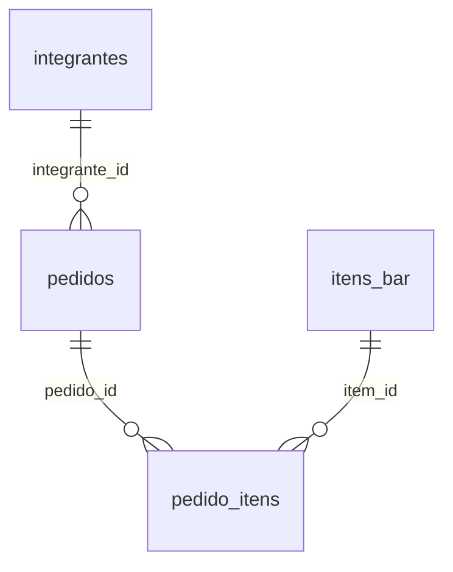

# Modelo de dados

## DAT-001 — Banco e convenções

O app usa `bar13.db` via `expo-sqlite`, com `PRAGMA foreign_keys = ON`. Este dicionário descreve as 11 tabelas da baseline, incluindo colunas legadas. Foi conferido com o DDL de [migrations](../src/database/migrations.ts) e os índices adicionais de [connection](../src/database/connection.ts), executados apenas em banco SQLite em memória para inspeção documental.

IDs numéricos são locais. `sync_id` é identidade de troca para cadastros, pedidos e linhas. Colunas booleanas são inteiros, convertidos com `Boolean` no mapeamento; valores monetários usam `REAL`/`number`, não centavos inteiros. Nomes SQL usam snake_case; [tipos de domínio](../src/types/domain.ts) e [tipos de sync](../src/types/sync.ts) usam camelCase.

Datas geradas no app usam horário local do aparelho: `YYYY-MM-DD`, `HH:mm:ss` e `YYYY-MM-DDTHH:mm:ss`, sem offset ou sufixo Z, apesar do nome `iso`. Não existe coluna própria de data de pagamento: `updated_at` também muda em outras operações, e dinheiro deixa a data do comprovante vazia.

## DAT-002 — Relações

Somente essas três relações são foreign keys. Operador/aparelho nos snapshots, eventos, blobs e fila se relacionam por strings e payloads sem foreign keys. A exclusão de pedido tem cascade nas linhas; exclusão de integrante/item não tem cascade do cadastro para pedidos.

## DAT-003 — Dicionário físico

A coluna “Obrigatório no DDL” reproduz `NOT NULL`. SQLite trata `INTEGER PRIMARY KEY` como identidade mesmo quando PRAGMA não o reporta como `NOT NULL`; as regras de entrada adicionais são aplicadas em código.

### `integrantes`

Nome tem unicidade SQL NOCASE; cadastro/CSV aplicam normalização adicional de acentos e espaços. Patente é normalizada para maiúsculas no fluxo local.

| Coluna | Tipo | Obrigatório no DDL | Padrão | PK |
| --- | --- | --- | --- | --- |
| `id` | `INTEGER` | Não | — | Sim |
| `sync_id` | `TEXT` | Sim | `''` | — |
| `nome` | `TEXT` | Sim | — | — |
| `patente` | `TEXT` | Sim | — | — |
| `created_at` | `TEXT` | Sim | — | — |
| `updated_at` | `TEXT` | Sim | — | — |

Unicidade: `sync_id` (parcial, somente sync ID não vazio); `nome`.

### `itens_bar`

`numero_item` é único, interno e gerado sequencialmente a partir do máximo atual. `nome` não tem restrição UNIQUE no SQLite; unicidade depende do código. `qtd_estoque` é saldo local e `ativo` controla listagem.

| Coluna | Tipo | Obrigatório no DDL | Padrão | PK |
| --- | --- | --- | --- | --- |
| `id` | `INTEGER` | Não | — | Sim |
| `sync_id` | `TEXT` | Sim | `''` | — |
| `numero_item` | `INTEGER` | Sim | — | — |
| `nome` | `TEXT` | Sim | — | — |
| `valor` | `REAL` | Sim | — | — |
| `qtd_estoque` | `INTEGER` | Sim | `0` | — |
| `ativo` | `INTEGER` | Sim | `1` | — |
| `created_at` | `TEXT` | Sim | — | — |
| `updated_at` | `TEXT` | Sim | — | — |

Unicidade: `sync_id` (parcial, somente sync ID não vazio); `numero_item`.

### `operadores`

Nome tem unicidade SQL NOCASE. Não existe senha, papel ou coluna de permissão. Inativação preserva o registro.

| Coluna | Tipo | Obrigatório no DDL | Padrão | PK |
| --- | --- | --- | --- | --- |
| `id` | `INTEGER` | Não | — | Sim |
| `sync_id` | `TEXT` | Sim | `''` | — |
| `nome` | `TEXT` | Sim | — | — |
| `ativo` | `INTEGER` | Sim | `1` | — |
| `created_at` | `TEXT` | Sim | — | — |
| `updated_at` | `TEXT` | Sim | — | — |

Unicidade: `sync_id` (parcial, somente sync ID não vazio); `nome`.

### `pedidos`

Status possui CHECK limitado a `ABERTO`, `FECHADO_AGUARDANDO_PAGAMENTO`, `PAGO`. `cancelado` é independente do status. `metodo_pagamento` não tem CHECK SQL. Total de cancelado é zerado no fluxo local e linhas permanecem.

| Coluna | Tipo | Obrigatório no DDL | Padrão | PK |
| --- | --- | --- | --- | --- |
| `id` | `INTEGER` | Não | — | Sim |
| `sync_id` | `TEXT` | Sim | `''` | — |
| `integrante_id` | `INTEGER` | Sim | — | — |
| `nome_integrante_snapshot` | `TEXT` | Sim | — | — |
| `patente_integrante_snapshot` | `TEXT` | Sim | — | — |
| `operador_sync_id_snapshot` | `TEXT` | Sim | `''` | — |
| `nome_operador_snapshot` | `TEXT` | Sim | `''` | — |
| `device_id_origem` | `TEXT` | Sim | `''` | — |
| `data_pedido` | `TEXT` | Sim | — | — |
| `hora_pedido` | `TEXT` | Sim | — | — |
| `data_hora_pedido` | `TEXT` | Sim | — | — |
| `status` | `TEXT` | Sim | — | — |
| `total` | `REAL` | Sim | `0` | — |
| `cancelado` | `INTEGER` | Sim | `0` | — |
| `cancelado_em` | `TEXT` | Sim | `''` | — |
| `metodo_pagamento` | `TEXT` | Sim | `''` | — |
| `comprovante_uri` | `TEXT` | Sim | `''` | — |
| `comprovante_nome` | `TEXT` | Sim | `''` | — |
| `comprovante_mime_type` | `TEXT` | Sim | `''` | — |
| `comprovante_adicionado_em` | `TEXT` | Sim | `''` | — |
| `created_at` | `TEXT` | Sim | — | — |
| `updated_at` | `TEXT` | Sim | — | — |

Unicidade: `sync_id` (parcial, somente sync ID não vazio).

### `pedido_itens`

`numero_item_snapshot` é legado, gravado como zero nas novas linhas. Não há UNIQUE para o par pedido/item. Quantidade e subtotal não têm CHECK SQL. Não há created_at/updated_at na linha; eventos carregam informações de atualização.

| Coluna | Tipo | Obrigatório no DDL | Padrão | PK |
| --- | --- | --- | --- | --- |
| `id` | `INTEGER` | Não | — | Sim |
| `sync_id` | `TEXT` | Sim | `''` | — |
| `pedido_id` | `INTEGER` | Sim | — | — |
| `item_id` | `INTEGER` | Sim | — | — |
| `numero_item_snapshot` | `INTEGER` | Sim | — | — |
| `nome_item_snapshot` | `TEXT` | Sim | — | — |
| `valor_unitario_snapshot` | `REAL` | Sim | — | — |
| `quantidade` | `INTEGER` | Sim | — | — |
| `subtotal` | `REAL` | Sim | — | — |

Unicidade: `sync_id` (parcial, somente sync ID não vazio).

### `configuracoes`

`id` tem CHECK `id = 1`. `caminho_imagem_qr_code` permanece no schema, mas não no tipo Configuracao nem na UI atual. `central_token` é armazenado como texto local; nenhum valor de configuração real foi lido nesta documentação. A linha padrão é inserida por INSERT OR IGNORE com texto inicial de cobrança.

| Coluna | Tipo | Obrigatório no DDL | Padrão | PK |
| --- | --- | --- | --- | --- |
| `id` | `INTEGER` | Não | — | Sim |
| `device_id` | `TEXT` | Sim | `''` | — |
| `nome_aparelho` | `TEXT` | Sim | `'Caixa'` | — |
| `operador_atual_sync_id` | `TEXT` | Sim | `''` | — |
| `operador_atual_nome` | `TEXT` | Sim | `''` | — |
| `chave_pix` | `TEXT` | Sim | `''` | — |
| `caminho_imagem_qr_code` | `TEXT` | Sim | `''` | — |
| `nome_bar` | `TEXT` | Sim | `'Bar13'` | — |
| `texto_padrao_cobranca` | `TEXT` | Sim | `''` | — |
| `central_web_app_url` | `TEXT` | Sim | `''` | — |
| `central_token` | `TEXT` | Sim | `''` | — |
| `sync_sequence` | `INTEGER` | Sim | `0` | — |
| `last_exported_at` | `TEXT` | Sim | `''` | — |
| `last_imported_at` | `TEXT` | Sim | `''` | — |

### `sync_events`

Payload completo fica em JSON textual. `event_id` e par `(device_id, sequence)` são únicos; inserções usam INSERT OR IGNORE. Não há CHECK SQL para enum de tipo de evento/entidade.

| Coluna | Tipo | Obrigatório no DDL | Padrão | PK |
| --- | --- | --- | --- | --- |
| `id` | `INTEGER` | Não | — | Sim |
| `event_id` | `TEXT` | Sim | — | — |
| `device_id` | `TEXT` | Sim | — | — |
| `device_name` | `TEXT` | Sim | — | — |
| `sequence` | `INTEGER` | Sim | — | — |
| `entity_type` | `TEXT` | Sim | — | — |
| `entity_sync_id` | `TEXT` | Sim | — | — |
| `event_type` | `TEXT` | Sim | — | — |
| `actor_operator_sync_id` | `TEXT` | Sim | `''` | — |
| `actor_operator_name` | `TEXT` | Sim | `''` | — |
| `payload_json` | `TEXT` | Sim | — | — |
| `created_at` | `TEXT` | Sim | — | — |

Unicidade: `device_id, sequence`; `event_id`.

### `sync_imports`

`package_id` é único. Contagens guardam o volume total do arquivo, enquanto resultado retornado pelo serviço informa quantidades novas efetivamente aplicadas.

| Coluna | Tipo | Obrigatório no DDL | Padrão | PK |
| --- | --- | --- | --- | --- |
| `id` | `INTEGER` | Não | — | Sim |
| `package_id` | `TEXT` | Sim | — | — |
| `source_device_id` | `TEXT` | Sim | — | — |
| `source_device_name` | `TEXT` | Sim | — | — |
| `exported_at` | `TEXT` | Sim | — | — |
| `imported_at` | `TEXT` | Sim | — | — |
| `event_count` | `INTEGER` | Sim | `0` | — |
| `blob_count` | `INTEGER` | Sim | `0` | — |

Unicidade: `package_id`.

### `known_devices`

Inclui o próprio aparelho e origens de pacotes registradas. Datas ausentes são strings vazias. Não é descoberta de aparelhos por rede.

| Coluna | Tipo | Obrigatório no DDL | Padrão | PK |
| --- | --- | --- | --- | --- |
| `device_id` | `TEXT` | Não | — | Sim |
| `nome_aparelho` | `TEXT` | Sim | — | — |
| `first_seen_at` | `TEXT` | Sim | — | — |
| `last_seen_at` | `TEXT` | Sim | — | — |
| `last_package_id` | `TEXT` | Sim | `''` | — |
| `last_exported_at` | `TEXT` | Sim | `''` | — |
| `last_imported_at` | `TEXT` | Sim | `''` | — |

Unicidade: `device_id`.

### `sync_blobs`

`blob_id` e `hash` são únicos. Arquivo fica fora do banco em `local_uri`; hash local é de 32 bits calculado sobre Base64, sem garantia criptográfica.

| Coluna | Tipo | Obrigatório no DDL | Padrão | PK |
| --- | --- | --- | --- | --- |
| `id` | `INTEGER` | Não | — | Sim |
| `blob_id` | `TEXT` | Sim | — | — |
| `nome` | `TEXT` | Sim | — | — |
| `mime_type` | `TEXT` | Sim | — | — |
| `local_uri` | `TEXT` | Sim | — | — |
| `hash` | `TEXT` | Sim | — | — |
| `created_at` | `TEXT` | Sim | — | — |

Unicidade: `hash`; `blob_id`.

### `central_push_batches`

Status no domínio é `PENDENTE`, `ENVIADO` ou `ERRO`, sem CHECK SQL. Payload exclui o token; tentativa usa configuração atual e guarda resposta ou mensagem de erro.

| Coluna | Tipo | Obrigatório no DDL | Padrão | PK |
| --- | --- | --- | --- | --- |
| `id` | `INTEGER` | Não | — | Sim |
| `batch_id` | `TEXT` | Sim | — | — |
| `status` | `TEXT` | Sim | — | — |
| `payload_json` | `TEXT` | Sim | — | — |
| `response_json` | `TEXT` | Sim | `''` | — |
| `error_message` | `TEXT` | Sim | `''` | — |
| `created_at` | `TEXT` | Sim | — | — |
| `last_attempt_at` | `TEXT` | Sim | `''` | — |
| `last_success_at` | `TEXT` | Sim | `''` | — |

Unicidade: `batch_id`.

## DAT-004 — Índices e evolução

Índices de consulta cobrem data e status de pedidos, vínculo de linhas, nome de operador, entidade de evento, origem/data de pacote e status/data de lote da central. IDs de sincronização não vazios têm índices únicos parciais nos cinco conjuntos de entidades.

`initializeDatabase` executa statements idempotentes e consulta `PRAGMA table_info` antes de adicionar colunas ausentes: pagamento/comprovante/cancelamento/identidade/autoria em pedidos; saldo e sync ID em itens; sync ID em integrantes/linhas; identidade, operador, sequência, central e timestamps em configuração; ator nos eventos. Cria tabelas/índices auxiliares quando ausentes. Não há número de versão de migração (`user_version`), rollback de schema ou reset automático para atualização.

`ensureSyncBootstrap` trata identidade, sync IDs ausentes e backfill de eventos após schema. A especificação não pressupõe que toda base legada possível tenha sido testada; falha de migração/backfill bloqueia o bootstrap do app.

## DAT-005 — Arquivos e ciclo de vida

| Artefato | Destino |
| --- | --- |
| Comprovante escolhido localmente | `<documentDirectory>/bar13/<prefixo>_<timestamp>_<nome sanitizado><extensão>` |
| CSV e pacote `.bar13sync` | `<documentDirectory>/bar13/exports/<nome gerado>` |
| Blob recebido por sincronização | `<documentDirectory>/bar13/sync-blobs/<hash>_<nome sanitizado>` |

Diretórios são criados sob demanda. Texto usa UTF-8 e blobs usam Base64 para transporte/leitura. Substituição de comprovante tenta apagar arquivo anterior depois de salvar o novo; não apaga automaticamente seu histórico de eventos/blobs. Limpezas CSV preservam arquivos; reset de configurações remove o diretório `bar13` inteiro. Não há retenção periódica ou coleta geral de arquivos órfãos.

## Aceitação e fontes

- **AC-DAT-01:** Dada base nova em ambiente de teste, quando inicializar, então existir as 11 tabelas, linha de configuração 1, índices e foreign keys habilitadas.
- **AC-DAT-02:** Dada base já inicializada compatível, quando inicializar novamente, então preservar registros sem tentar duplicar colunas/índices.
- **AC-DAT-03:** Dados dois cadastros com mesmo sync ID não vazio, quando persistir o segundo, então a unicidade SQL deve impedir duplicação.

Fontes: [schema](../src/database/migrations.ts), [conexão/migrações/reset](../src/database/connection.ts), [bootstrap](../src/services/sincronizacaoService.ts), [arquivos](../src/utils/file.ts), [datas](../src/utils/date.ts).
