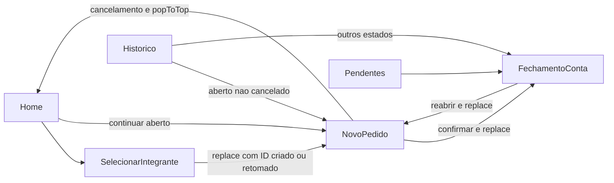

# Navegação e interface

## UI-001 — Rotas

`HomeTabs` é a raiz do native stack, sem cabeçalho próprio. Contém cinco abas; dez telas auxiliares ficam no stack. Cabeçalhos e barras usam tema escuro; barra de status é clara. A navegação não possui autenticação ou guardas por perfil.

| Rota | Local | Parâmetros | Contrato da tela |
| --- | --- | --- | --- |
| `Home` | Aba | `returnToAjuda?` | Indicadores de hoje, operador atual, abertos, atalhos e envio à central |
| `Historico` | Aba | `returnToAjuda?` | Navegação por dia e acesso aos pedidos de todos os estados |
| `Relatorios` | Aba | `returnToAjuda?` | Período, seis métricas, pedidos, devedores, consumo e estoque |
| `Pendentes` | Aba | `returnToAjuda?` | Contas fechadas por período, cobrança copiada e abertura do pagamento |
| `Configuracoes` | Aba | `returnToAjuda?` | Dados locais, central, atalhos, salvamento automático/manual e reset |
| `SelecionarIntegrante` | Stack | `returnToAjuda?` | Busca por nome, cadastro/importação auxiliares e criação/retomada |
| `GerenciarIntegrantes` | Stack | `returnToAjuda?` | Criar/editar/excluir integrante, busca e CSV |
| `GerenciarItens` | Stack | `returnToAjuda?` | Criar/editar/excluir item, preço/saldo, busca e filtro sem estoque |
| `GerenciarOperadores` | Stack | `returnToAjuda?` | Gestão de equipe, atividade e seleção atual |
| `NovoPedido` | Stack | `pedidoId: number` obrigatório | Cards de itens, quantidades, total, cancelamento e fechamento |
| `FechamentoConta` | Stack | `pedidoId: number` obrigatório | Consulta, QR PIX, pagamento, comprovante, cobrança e reabertura |
| `ImportacaoCsv` | Stack | `mode: integrantes ou itens`, `returnToAjuda?` | Seleção CSV, resultado e limpeza de base |
| `Sincronizacao` | Stack | `returnToAjuda?` | Exportação/importação de pacote, prévia, aparelhos, últimos pacotes e central |
| `ExportacaoCsv` | Stack | `returnToAjuda?` | Período próprio e quatro exportações |
| `Ajuda` | Stack | Nenhum | Guia de primeiro uso, operação, operadores/central, cobrança, histórico, relatórios e CSV |

Os tipos reais estão em [navigation.ts](../src/types/navigation.ts); nomes de rota não são os títulos traduzidos dos cabeçalhos.

## UI-002 — Fluxo de atendimento

Configurações centraliza acessos a todas as operações auxiliares. Home também abre Pendentes, Exportação e Ajuda. Seleção de integrante abre cadastro/importação; NovoPedido abre cadastro/importação de itens. Relatórios abre exportação sem passar o período e oferece consulta de fechamento para pedidos não abertos ou cancelados.

## UI-003 — Guia rápido

Ajuda é conteúdo estático dentro do app, com checklist de preparação, instruções, opções de CSV e botões que levam às telas relacionadas. Links do guia podem usar `returnToAjuda: true`. `ReturnToGuideButton` mostra “Voltar ao guia rápido” apenas quando esse parâmetro está verdadeiro; ao tocar, define o parâmetro como falso e navega para Ajuda.

Não há progresso de treinamento persistido. O parâmetro não é propagado automaticamente para `NovoPedido`/`FechamentoConta`, que aceitam somente pedidoId. Algumas instruções do guia podem estar desatualizadas; regras efetivas vêm das specs funcionais e fontes de código.

## UI-004 — Componentes comuns

| Componente | Comportamento |
| --- | --- |
| `ScreenContainer` | ScrollView por padrão, fundo/padding/espaçamento do tema; opção sem scroll usa View |
| `SectionCard` | Agrupa título, subtítulo opcional e conteúdo |
| `AppButton` | Variantes primary/secondary/danger/outline, mínimo 48 de altura, loading com indicador; loading ou disabled bloqueia toque |
| `SearchInput` | Campo de busca reutilizável; a filtragem é feita por tela/repositório |
| `EmptyState` | Título e descrição para ausência de registros ou carregamento |
| `StatCard` | Métrica e rótulo, sem cálculo próprio |
| `PedidoCard` | Snapshots, status/cancelamento, consumo, total, comprovante e rodapé de ações fornecido pela tela |
| `ItemCard` | Nome, preço, saldo, ação de adicionar ou “Esgotado”; usa largura de 48% |
| `OrderItemRow` | Nome, quantidade, preço snapshot e subtotal; `locked` oculta `+`/`-` |
| `DateRangeFilter` | Datas livres e presets hoje/7/30; destaca preset e informa período manual ao editar |
| `ReturnToGuideButton` | Retorno contextual ao guia |

Tema centraliza cores escuras, destaque dourado, perigo, espaçamentos e raios. Não há certificação de acessibilidade, layout tablet dedicado ou virtualização geral de listas nesta baseline.

## UI-005 — Carregamento e erros

Bootstrap impede acesso às telas até o banco ficar pronto. Cadastros, importações, exportações e recebimentos usam alertas para resultados/erros; fluxos de central possuem progresso. Várias leituras iniciadas por `void load()` não têm tratamento local completo de rejeição; não existe uma tela global de recuperação. Busy/loading é estado local por tela, não um bloqueio global de escrita do app.

## Aceitação

- **AC-UI-01:** Dado bootstrap concluído, quando navegar, então encontrar as cinco abas e dez rotas auxiliares descritas.
- **AC-UI-02:** Dado acesso a uma tela via guia com `returnToAjuda=true`, quando tocar no retorno, então reabrir Ajuda e limpar a flag nessa rota.
- **AC-UI-03:** Dado `AppButton` com loading ou disabled, quando tocar, então não disparar sua ação.
- **AC-UI-04:** Dado fechamento, quando visualizar linhas, então não mostrar controles de alteração de quantidade.

## Fontes

[Navigator](../src/navigation/AppNavigator.tsx), [tipos](../src/types/navigation.ts), [telas](../src/screens), [componentes](../src/components), [Ajuda](../src/screens/AjudaScreen.tsx), [tema](../src/constants/theme.ts).
